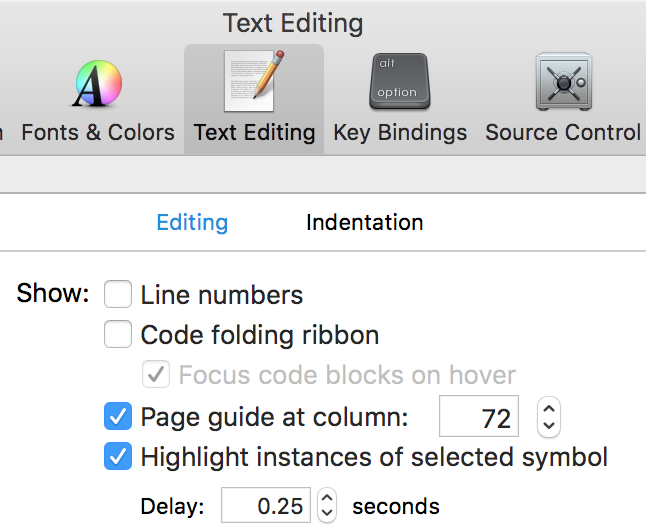

# gfm-wordpress

Process GitHub flavored Markdown so it can be pasted directly into WordPress.

I (Jason Smith) use this tool for writing blog posts in a project on GitHub, but then publish them on the IBM Developerworks blog. If you are not blogging for the Cloud Data Services developer advocacy group, I am not sure you will find this very useful. But maybe.

## Features

GFM-WordPress does a few things:

1. Convert GitHub-flavored Markdown to HTML
1. Correct syntax highlighting (embed the required CSS) in the HTML
1. Fix a few CSS bugs
1. Build a Table of Contents
1. Automatically correct links to a `media/` subdirectory, so that they work from WordPress
1. If an image retina resolution (`"foo@2x.png"`), reduce its size so it does not look ridiculous

## Authoring a Document

Make a Markdown document in any Git project. You can preview it in GitHub normally. Follow two rules:

1. In code samples, do not exceed 72 characters per line, or it will auto-wrap and look ugly. You can set a guide in the Xcode preferences. But remember not to take a screenshot with the guide enabled.

  
1. Commit images in `media/` relative to your `.md` file. Reference it like this: ``
1. Commit downloads in `media/` just like images. Link to them normally, e.g. `[example-download]: media/example-project.tar.gz`

If you follow these rules, everything will work when you view the document in GitHub, **and** it will work when you paste into WordPress.

## Usage

Install with NPM:

    npm install --global gfm-wordpress

To use the tool, you have to figure out the "media" location for your post. This is the directory WordPress will store your images, downloads, etc.

There are two ways to figure out the media location: by using the URL of an image already uploaded, or by "guessing."

1. The sure-fire way: Get an image URL from your post draft:
  1. Log in to WordPress
  1. Create a draft post. Click "Save Draft" at least once, just to be sure.
  1. Click "Add Media"
  1. Click the "Upload Files" tab and click the "Select Files" button
  1. Select a file and upload it in.
  1. When the upload is done, click the image so it is checked
  1. In the right sidebar, the URL will be visible. Select the entire URL and copy it to your clipboard.
2. The "guessing" way: Just do step 1 a lot until you know the system by heart. The media location seems to change only once per month. I think it is `47/2016/MM` where MM is the current month. I have no idea whatsoever what the "47" means. Maybe we are the 47th blog installed on this WordPress server?

Once you know your media location, run the tool:

    gfm-wordpress README.md --media=47/2016/01

But you can also paste the full URL of an image; `gfm-wordpress` will extract the media location from that URL.

The HTML will arrive on stdout. Copy all of the HTML and paste it into the blog editor. You should **completely overwrite** the previous post content. The idea is that all authoring is in Markdown. WordPress only hosts the final HTML.

## Finishing

You must upload all media manually. Just follow the procedure from the Usage section above. As you preview the post, the images should render, because the gfm-wordpress output HTML is already referencing them correctly.

If you do not see the images, one problem I suspect is that they need to be pushed to a CDN of some sort. Try clicking "Insert into post". (You will notice it takes longer than you'd think.) Once it inserts the HTML into your post, just delete that HTML.

If you are on the CDS team, check the [blog post of this very file][example-draft] (it is private, so you must be logged in or it will 404).

## License

Apache 2.0

[example-draft]: https://developer.ibm.com/clouddataservices/2018/01/30/gfm-wordpress-example/
