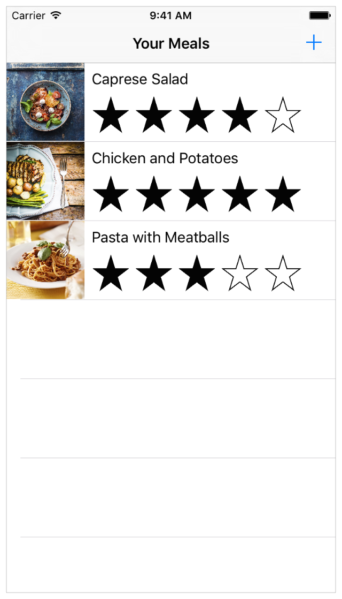

# Awesome Blog Post

This is an awesome blog post.

I hope you like it. Read more at our [main blog][cds-blog].

## First Section

This is the first section. It should be the first entry in the table of contents.

### Section 1.1

This is a subsection of the first section. It should be the first nested entry in the table of contents.

### Section 1.2

This is another subsection. I think it is obvious where this belongs

### Section Goals

The goal of this section is for you to read the above subsections. Also, this section's heading will conflict with one below.

## Second section

This is the second section. How about some code samples?

### Section Goals

In this section, you will see some example code. Also, this section's heading conflicts with one above.

### Swift Hello World

Do this for an introduction to Swift

1. Open Xcode
1. Create a new file, `hello.swift`
1. In `hello.swift`, add this function:
  ``` swift
  #if DEBUG
      let target = "debugging world"
  #else
      let target = "world"
  #endif

  print("Hello, \(target)!")
  ```
1. You're done!

### JavaScript

And in JavaScript since I will surely need to publish some JS code at some point:

``` js
// passwd.js for Node.js
//
var fs = require('fs')

fs.readFile('/etc/passwd', 'utf8', function(er, passwd) {
  if (er)
    throw er

  var lines = passwd.split(/\n/)
  console.log('You have %s lines in your passwd file', lines.length)
})
```

#### How to run the code

To run this:

    node passwd.js --disable-bugs
    You have 96 lines in your passwd file

By the way, this section's heading should not get into the TOC because it is too minor.

## Conclusion

In conclusion, I really hope this works.


Above is a picture of Tux, by Larry Ewing *<lewing@isc.tamu.edu>* who created it with [The Gimp][gimp]. Expected behavior:

  * Browsing in GitHub will **succeed** because the image is checked into the project: `img/Tux.png`
  * Browsing from `npm test` will **succeed** because the URL is not rewritten as the image is not in the `media/` directory.

[Download FoodTracker][code-download]! Expected behavior:

  * Clicking while browsing in GitHub will **fail** because the file is not actually committed into Git.
  * Clicking from `npm test` will **succeed**. The link is rewritten to WordPress and the download will work.

Below is a screenshot of an iOS app, `media/FoodTracker.png`. Expected behavior:

  * Browsing in GitHub will **succeed** because it is commited into this project. But it will not be a clickable link.
  * Browsing from `npm test` will **succeed** because the link is rewritten to a published WordPress media file. Furthermore, it should be a clickable link directly to the file itself.




[END]: ----------------------------------------

[cds-blog]: https://developer.ibm.com/clouddataservices/blog/
[code-download]: media/FoodTracker-Cloudant-Sync-1.zip
[gimp]: https://www.gimp.org/
